  

<table align="center" width="100%">
<tr>
<td width="5%"></td>
<td align="center" width="44%">
  <picture>
    <source media="(prefers-color-scheme: dark)"  srcset="https://github-readme-stats.vercel.app/api?username=SarahiCruzAguirre&show_icons=true&count_private=true&rank_icon=github&bg_color=0d1117&title_color=56E1E8&text_color=e2e8f0&icon_color=5C58ED&border_color=1e3a5f&custom_title=Sarahi%27s%20GitHub%20Stats"/>
    <source media="(prefers-color-scheme: light)" srcset="https://github-readme-stats.vercel.app/api?username=SarahiCruzAguirre&show_icons=true&count_private=true&rank_icon=github&bg_color=f0f6ff&title_color=1d4ed8&text_color=0f172a&icon_color=4f46e5&border_color=bfdbfe&custom_title=Sarahi%27s%20GitHub%20Stats"/>
    
  </picture>
</td>
<td width="2%"></td>
<td align="center" width="44%">
  <picture>
    <source media="(prefers-color-scheme: dark)"  srcset="https://github-readme-stats.vercel.app/api/top-langs/?username=SarahiCruzAguirre&layout=compact&langs_count=8&bg_color=0d1117&title_color=56E1E8&text_color=e2e8f0&icon_color=5C58ED&border_color=1e3a5f"/>
    <source media="(prefers-color-scheme: light)" srcset="https://github-readme-stats.vercel.app/api/top-langs/?username=SarahiCruzAguirre&layout=compact&langs_count=8&bg_color=f0f6ff&title_color=1d4ed8&text_color=0f172a&icon_color=4f46e5&border_color=bfdbfe"/>
    
  </picture>
</td>
<td width="5%"></td>
</tr>
<tr>
<td></td>
<td align="center" colspan="3">
  <picture>
    <source media="(prefers-color-scheme: dark)"  srcset="https://github-readme-streak-stats.herokuapp.com/?user=SarahiCruzAguirre&background=0d1117&border=1e3a5f&stroke=1e3a5f&ring=56E1E8&fire=3FA9F5&currStreakNum=e2e8f0&currStreakLabel=56E1E8&sideNums=e2e8f0&sideLabels=3FA9F5&dates=5C58ED"/>
    <source media="(prefers-color-scheme: light)" srcset="https://github-readme-streak-stats.herokuapp.com/?user=SarahiCruzAguirre&background=f0f6ff&border=bfdbfe&stroke=bfdbfe&ring=1d4ed8&fire=4f46e5&currStreakNum=0f172a&currStreakLabel=1d4ed8&sideNums=0f172a&sideLabels=1d4ed8&dates=4f46e5"/>
    
  </picture>
</td>
<td></td>
</tr>
</table>

<picture>
  <source media="(prefers-color-scheme: dark)"  srcset="https://github-readme-activity-graph.vercel.app/graph?username=SarahiCruzAguirre&bg_color=0d1117&color=56E1E8&line=5C58ED&point=3FA9F5&area=true&area_color=122D70&hide_border=false&border_color=1e3a5f&radius=8"/>
  <source media="(prefers-color-scheme: light)" srcset="https://github-readme-activity-graph.vercel.app/graph?username=SarahiCruzAguirre&bg_color=f0f6ff&color=1d4ed8&line=4f46e5&point=0891b2&area=true&area_color=dbeafe&hide_border=false&border_color=bfdbfe&radius=8"/>
  
</picture>

<picture>
  <source media="(prefers-color-scheme: dark)"  srcset="https://raw.githubusercontent.com/SarahiCruzAguirre/SarahiCruzAguirre/output/github-contribution-grid-snake-dark.svg"/>
  <source media="(prefers-color-scheme: light)" srcset="https://raw.githubusercontent.com/SarahiCruzAguirre/SarahiCruzAguirre/output/github-contribution-grid-snake.svg"/>
  
</picture>

